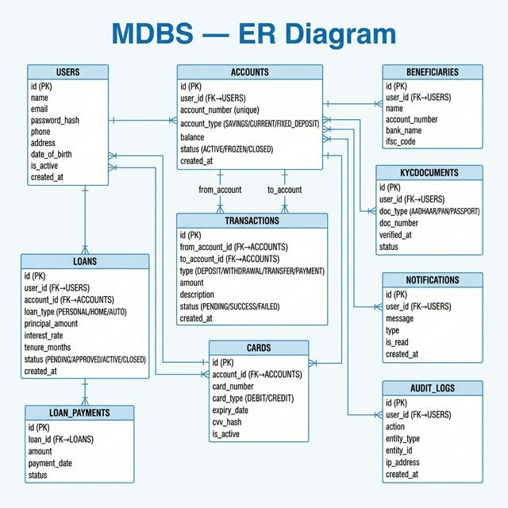

# ER Diagram — Mini Digital Banking System (MDBS)

## Overview

This ER diagram shows all database tables, their columns, data types, primary/foreign keys, and relationships for the MDBS platform.

---

## ER Diagram

---

## Table Descriptions

### `users`
Central table for all platform users. The `role` enum differentiates `CUSTOMER`, `BANK_TELLER`, and `ADMIN`. Stores personal info and auth credentials.

### `accounts`
Represents a bank account. Each user can have multiple accounts of different types (`SAVINGS`, `CURRENT`, `FIXED_DEPOSIT`). Tracks real-time `balance` and `status` (`ACTIVE`, `FROZEN`, `CLOSED`).

### `transactions`
Immutable record of every financial event. `from_account_id` and `to_account_id` both reference `accounts`. For deposits, `from_account_id` is NULL; for withdrawals, `to_account_id` is NULL.

### `loans`
Tracks loan applications and their lifecycle (`PENDING → APPROVED → ACTIVE → CLOSED`). Stores principal, interest rate, and tenure. EMI is calculated at the service layer.

### `loan_payments`
Individual EMI payment records linked to a loan. Tracks payment date and status for repayment history.

### `cards`
Debit or Credit cards linked to an account. CVV is stored as a hash. `is_active` flag for card blocking.

### `beneficiaries`
Saved payees for quick fund transfers. Stores external account number, bank name, and IFSC code.

### `kyc_documents`
KYC verification records per user. Supports Aadhaar, PAN, and Passport. `verified_at` is set when a Bank Teller approves.

### `notifications`
In-app notification records. `is_read` flag for read/unread status. Triggered by transactions, loan updates, etc.

### `audit_logs`
Compliance trail of all user actions. Stores action type, entity affected, and IP address for security auditing.

---

## Tables & Columns

| Table | Key Columns |
|---|---|
| `users` | id (PK), name, email (UK), password_hash, role, phone, is_active |
| `accounts` | id (PK), user_id (FK), account_number (UK), account_type, balance, status |
| `transactions` | id (PK), from_account_id (FK, nullable), to_account_id (FK, nullable), type, amount, status |
| `loans` | id (PK), user_id (FK), account_id (FK), loan_type, principal_amount, interest_rate, tenure_months, status |
| `loan_payments` | id (PK), loan_id (FK), amount, payment_date, status |
| `cards` | id (PK), account_id (FK), card_number, card_type, expiry_date, cvv_hash, is_active |
| `beneficiaries` | id (PK), user_id (FK), name, account_number, bank_name, ifsc_code |
| `kyc_documents` | id (PK), user_id (FK), doc_type, doc_number, verified_at, status |
| `notifications` | id (PK), user_id (FK), message, type, is_read |
| `audit_logs` | id (PK), user_id (FK), action, entity_type, entity_id, ip_address |

---

## Key Constraints

| Constraint | Details |
|---|---|
| `users.email` | UNIQUE — no duplicate accounts |
| `accounts.account_number` | UNIQUE — globally unique account number |
| `transactions.from_account_id` | Nullable — NULL for cash deposits |
| `transactions.to_account_id` | Nullable — NULL for cash withdrawals |
| `kyc_documents.verified_at` | Nullable — NULL until Bank Teller verifies |
| `cards.cvv_hash` | Hashed — never stored in plain text |
| Soft delete | `users.is_active` and `accounts.status` used instead of hard delete |
