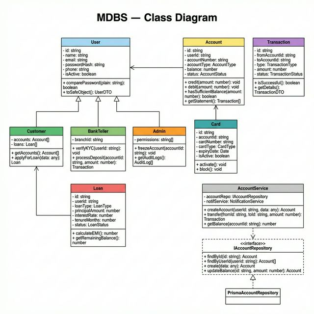

# Class Diagram — Mini Digital Banking System (MDBS)

## Overview

The class diagram shows the major classes, their attributes, methods, and relationships in the MDBS backend. The architecture follows a layered pattern: **Controllers → Services → Repositories → Models**.

---

## Class Diagram

---

## Design Pattern Summary

| Pattern | Class(es) | Rationale |
|---|---|---|
| **Repository Pattern** | `IAccountRepository`, `ITransactionRepository`, etc. | Decouples business logic from Prisma/DB; easy to swap implementations |
| **Factory Pattern** | `UserFactory` | Creates `Customer`, `BankTeller`, or `Admin` based on role without exposing constructor logic |
| **Strategy Pattern** | `InterestCalculationStrategy`, `FlatRateStrategy`, `ReducingBalanceStrategy` | Allows swapping loan interest calculation algorithms at runtime |
| **Singleton Pattern** | `PrismaClientSingleton` | Single DB connection instance shared across all repositories |
| **Observer Pattern** | `TransactionEventEmitter` → `NotificationService` | Decoupled notification triggering on transaction events |

---

## Key Classes

### Models / Entities

| Class | Role |
|---|---|
| `User` | Base class with shared auth fields; extended by role-specific classes |
| `Customer` | Has accounts and loans; can apply for loans and transfer funds |
| `BankTeller` | Can verify KYC and process branch transactions |
| `Admin` | Full platform access; can freeze accounts and view audit logs |
| `Account` | Core banking entity; tracks balance, type, and status |
| `Transaction` | Immutable record of every financial event |
| `Loan` | Tracks principal, interest, tenure, and repayment status |
| `Card` | Debit/Credit card linked to an account |

### Repository Interfaces

| Interface | Purpose |
|---|---|
| `IAccountRepository` | Abstracts all account DB operations |
| `ITransactionRepository` | Abstracts all transaction DB operations |
| `ILoanRepository` | Abstracts all loan DB operations |

### Services

| Service | Responsibility |
|---|---|
| `AuthService` | Registration, login, JWT generation/verification |
| `AccountService` | Account creation, balance management, fund transfers |
| `TransactionService` | Atomic transaction processing with rollback support |
| `LoanService` | Loan application, EMI calculation, approval workflow |
| `NotificationService` | Sends in-app/email notifications on events |
| `AuditService` | Logs all user actions for compliance |

### Controllers

| Controller | Routes Handled |
|---|---|
| `AuthController` | `POST /auth/register`, `POST /auth/login` |
| `AccountController` | `GET /accounts`, `POST /accounts`, `GET /accounts/:id/statement` |
| `TransactionController` | `POST /transactions/transfer`, `POST /transactions/deposit` |
| `LoanController` | `POST /loans/apply`, `PATCH /loans/:id/approve`, `POST /loans/:id/pay` |
| `CardController` | `POST /cards/request`, `PATCH /cards/:id/block` |
| `AdminController` | `GET /admin/analytics`, `PATCH /accounts/:id/freeze` |
