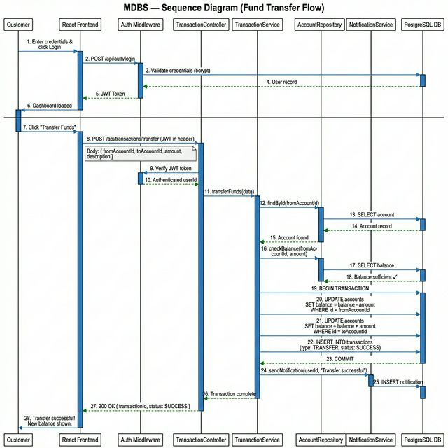

# Sequence Diagram — Mini Digital Banking System (MDBS)

## Main Flow: Customer Transfers Funds (End-to-End)



---

## Flow Description

### Phase 1: Authentication
1. Customer enters credentials and clicks Login
2. Frontend sends `POST /api/auth/login` to Auth Middleware
3. Auth Middleware validates credentials against DB (bcrypt compare)
4. DB returns user record → JWT Token issued → Dashboard loaded

### Phase 2: Initiate Transfer
5. Customer clicks "Transfer Funds" and fills in beneficiary + amount
6. Frontend sends `POST /api/transactions/transfer` with JWT in header
7. Auth Middleware verifies JWT → extracts authenticated `userId`

### Phase 3: Business Logic (TransactionService)
8. `TransactionController` calls `TransactionService.transferFunds(data)`
9. `TransactionService` calls `AccountRepository.findById(fromAccountId)` → validates account exists
10. `TransactionService` calls `AccountRepository.checkBalance(fromAccountId, amount)` → validates sufficient funds

### Phase 4: Atomic DB Transaction
11. `BEGIN TRANSACTION`
12. `UPDATE accounts SET balance = balance - amount WHERE id = fromAccountId`
13. `UPDATE accounts SET balance = balance + amount WHERE id = toAccountId`
14. `INSERT INTO transactions (type: TRANSFER, status: SUCCESS)`
15. `COMMIT`

### Phase 5: Notification & Response
16. `NotificationService.sendNotification(userId, "Transfer successful")`
17. Notification saved to DB
18. `200 OK { transactionId, status: SUCCESS }` returned to frontend
19. Customer sees updated balance and success message

---

## Secondary Flow: Insufficient Balance

```
TransactionService → AccountRepository: checkBalance(fromAccountId, amount)
AccountRepository → DB: SELECT balance
DB → AccountRepository: Balance insufficient ✗
TransactionService → TransactionController: throw InsufficientFundsError
TransactionController → Frontend: 400 Bad Request { error: "Insufficient balance" }
Frontend → Customer: Error shown — "Insufficient balance"
```

---

## Secondary Flow: Loan Application

```
Customer → Frontend: Fill loan application form
Frontend → LoanController: POST /api/loans/apply
LoanController → LoanService: applyForLoan(userId, data)
LoanService → LoanService: calculateEMI(principal, rate, tenure)
LoanService → DB: INSERT INTO loans (status: PENDING)
LoanService → NotificationService: notify BankTeller of new application
BankTeller → LoanController: PATCH /api/loans/:id/approve
LoanController → LoanService: approveLoan(loanId)
LoanService → DB: UPDATE loans SET status = APPROVED
LoanService → DB: UPDATE accounts SET balance = balance + principalAmount
LoanService → NotificationService: notifyCustomer(APPROVED)
Customer ← Notification: Loan approved! Amount credited to account.
```
