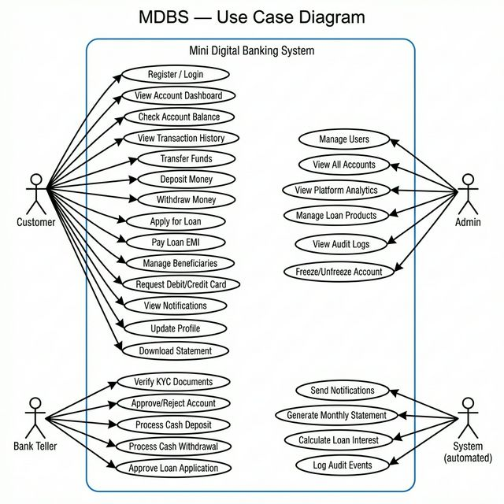

# Use Case Diagram — Mini Digital Banking System (MDBS)

## Actors

| Actor | Description |
|---|---|
| **Customer** | Bank account holder who performs banking operations |
| **Bank Teller** | Branch staff who handles KYC, cash operations, and loan approvals |
| **Admin** | Platform administrator who manages the system and views analytics |
| **System** | Automated processes (notifications, statements, interest calculation) |

---

## Use Case Diagram

---

## Use Case Descriptions

### UC — Transfer Funds
- **Actor**: Customer
- **Precondition**: Customer logged in, beneficiary added, sufficient balance
- **Main Flow**:
  1. Customer selects beneficiary and enters amount
  2. System validates balance
  3. System debits sender's account
  4. System credits receiver's account
  5. System records transaction
  6. System sends notification to both parties
- **Postcondition**: Transfer complete, both accounts updated

### UC — Apply for Loan
- **Actor**: Customer
- **Precondition**: Customer logged in, KYC verified
- **Main Flow**:
  1. Customer selects loan type and enters amount/tenure
  2. System calculates EMI and interest
  3. Customer confirms application
  4. System creates loan with status `PENDING`
  5. Bank Teller reviews and approves/rejects
- **Postcondition**: Loan created, EMI schedule generated

### UC — Verify KYC Documents
- **Actor**: Bank Teller
- **Precondition**: Customer has submitted KYC documents
- **Main Flow**:
  1. Teller views pending KYC requests
  2. Teller reviews document details
  3. Teller marks as verified or rejected
  4. System updates KYC status
  5. System notifies customer
- **Postcondition**: Customer KYC status updated

### UC — Freeze Account
- **Actor**: Admin
- **Precondition**: Account exists and is active
- **Main Flow**:
  1. Admin views account details
  2. Admin triggers freeze action
  3. System updates account status to `FROZEN`
  4. System blocks all transactions on that account
  5. System notifies customer
- **Postcondition**: Account frozen, transactions blocked
